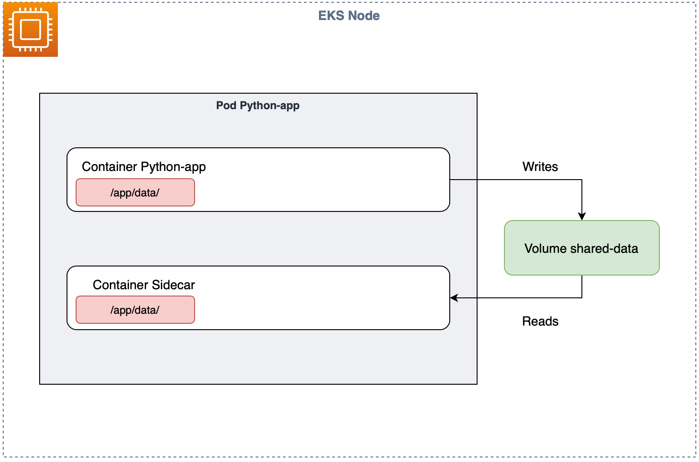
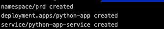
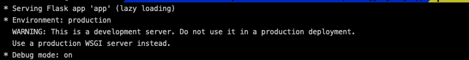
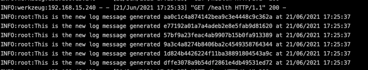

# EKS Multi Container Pod Logging

This demonstration has the purpose of showing how to use multi-container Pods to export application logs to stdout on Amazon EKS, in that way a log proccessor can collect all the logs and send to a log centralizer.

**This demonstration was tested in us-east-1 region**

## Architecture

<p align="center"> 

</p>

## Pre Reqs

- [eksctl](https://eksctl.io/)
- [awscli](https://aws.amazon.com/cli/)
- [kubectl](https://kubernetes.io/docs/reference/kubectl/kubectl/)

## Provision EKS cluster

We are going to use eksctl to provision our EKS cluster for this demonstration, eksctl will provision the Kubernetes master, nodes and **also the VPC**.

```shell
eksctl create cluster -f kubernetes-cluster-us-east-1.yaml
```

Now we have to configure our `~/.kube/config` file in order to access our cluster using kubectl.

```shell
aws eks --region us-east-1 update-kubeconfig --name kubelogs-cluster
```

This will update your kube config file, now let's test if we can access our cluster.

```shell
kubectl get nodes
```

## Creating our application Docker image and ECR repository

In this step we are going to build our application Docker image and create our ECR repository, after that we are going to push the image to the repository, so we will be able to create our application inside our Amazon EKS cluster.

```shell
aws ecr create-repository --repository-name multi-container-pod-demo
```

Let's build our Docker image

```shell
cd log-app && docker build -t multi-container-pod-demo .
```

Retrieve an authentication token and authenticate your Docker client to your registry, replace the variables **<>** with your information

```shell
aws ecr get-login-password --region <REGION> | docker login --username AWS --password-stdin <ACCOUNT_ID>.dkr.ecr.us-east-1.amazonaws.com
```

After the build completes, tag your image so you can push the image to ECR repository.

```shell
docker tag multi-container-pod-demo:latest <ACCOUNT_ID>.dkr.ecr.<REGION>.amazonaws.com/multi-container-pod-demo:latest
```

Run the following command to push this image to your newly created AWS repository

```shell
docker push <ACCOUNT_ID>.dkr.ecr.<REGION>.amazonaws.com/multi-container-pod-demo:latest
```

## Kubernetes Manifests

In order to our app work we will need to replace the variable inside our Deployment manifest with our new image that we just published in the ECR.

Open `log-app/eks/01-deployment.yaml` and change `__IMAGE_URI__` to your image URI.

```yaml
containers:
      - name: python-app
        image: __IMAGE_URI__
        ports:
        - containerPort: 5000
```

It will look like the following

```yaml
containers:
      - name: python-app
        image: <ACCOUNT_ID>.dkr.ecr.<region>.amazonaws.com/multi-container-pod-demo:latest
        ports:
        - containerPort: 5000
```

Let's deploy our application inside the cluster.

```shell
kubectl apply -f eks/
```

It will create 3 objecs, namespace, deployment and service.

<p align="center"> 

</p>

## Checking application logs

It's time to check if our multi-container pod works.

Let's check our Pod

```shell
kubectl get pods -n prd
```

Get logs of our Python application

```
kubectl logs po/<POD_NAME> -c python-app -n prd
```

<p align="center"> 

</p>

It will return just the logs of the server initialization, but not the request logs because it writes in a file.

Get logs of our side car container that is responsible to output the logs to stdout.

```shell
kubectl logs po/<POD_NAME> -c sidecar -n prd -f
```

As you can see it show our requests logs, let this terminal open and open other terminal.

Open a new terminal and get the service URL.

```shell
kubectl get svc -n prd | awk '{print $4}'
```

Now execute a request to the service public URL.

```shell
curl -IL -XGET http://<SERVICE_URL>/log
```
<p align="center"> 

</p>

It will generate random log messsages, as you can see above.

Let's once again check the logs of the python-app container.

```shell
kubectl logs po/<POD_NAME> -nprd -c python-app
```
<p align="center"> 

</p>

No new logs were generated.

## Security

See [CONTRIBUTING](CONTRIBUTING.md#security-issue-notifications) for more information.

## License

This library is licensed under the MIT-0 License. See the LICENSE file.

